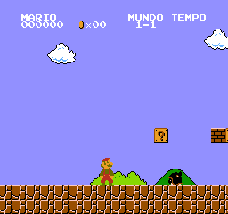

# Evidência S005 — 07/10/2026 UTC

HEAD de entrada: 11cd0245985577ea7d6ef3a3e47ff015e06f13ed.
O commit que adiciona este diretório contém a implementação medida.

- baseline-5m.txt: antes da correção de timing, reproduz o resultado S001.
- start-right.txt / long-run.txt: depois da correção, 5m e 50m instruções.
  Contêm fingerprints, ciclos, PC, linha/dot, contagens de opcodes e NMIs.
- host-tests.txt / sanitizer-tests.txt: sete suítes, incluindo testes novos.
- regression-old-core.txt: falha esperada do teste novo contra o core anterior.
- frames.tar.xz: índices originais baseline.bin, s005-5m.bin e s005-50m.bin.
- sha256.json: hashes dos arquivos e dos quadros extraídos.
- start-right.png: conversão sem redimensionamento de s005-5m.bin.



A imagem demonstra que a afirmação anterior de HUD ausente estava errada.
MARIO, MUNDO, TEMPO, pontuação e moedas estão visíveis. Baseline e quadro S005
são idênticos byte a byte: não houve correção de HUD nesta sessão.
Isso não certifica o restante do HUD ou a equivalência visual com um NES.

## Reprodução

```sh
sh tests/run_host_tests.sh
python3 tools/run_canonical.py --instructions 5000000 --input tests/canonical_start_right.input --frame build/gameplay.bin > build/gameplay.txt
diff -u docs/evidence/S005/start-right.txt build/gameplay.txt
python3 tools/frame_to_png.py build/gameplay.bin build/gameplay.png
python3 tools/run_canonical.py --instructions 50000000 --input tests/canonical_start_right.input --frame build/long.bin > build/long.txt
diff -u docs/evidence/S005/long-run.txt build/long.txt
ASAN_OPTIONS=detect_leaks=0 SANITIZE=1 sh tests/run_host_tests.sh
ASAN_OPTIONS=detect_leaks=0 python3 tools/run_canonical.py --instructions 5000000 --input tests/canonical_start_right.input --frame build/sanitized.bin > build/sanitized.txt
diff -u docs/evidence/S005/start-right.txt build/sanitized.txt
cmp build/gameplay.bin build/sanitized.bin
```

Todos esses testes foram executados localmente; a execução sanitizada de 5m
produziu o mesmo log e quadro. ASan/UBSan habilitados, leak detection desabilitado
por limitação conhecida do ambiente. Não afirmar validação de leaks.
Compilação: C99, -O2 -Wall -Wextra -Werror.

## Timing e limites

Implementação omite dot 340 no pre-render ímpar se PPUMASK habilitar background
ou sprites. Paridade avança mesmo desligado. Base técnica:
https://www.nesdev.org/wiki/PPU_frame_timing e
https://www.nesdev.org/wiki/PPU_rendering . Acesso direto deu HTTP 403;
conteúdo técnico foi conferido pela versão indexada dessas páginas.
Teste sintético valida também habilitação/desabilitação no limite e alternância
por seis frames. O core antigo falha ao completar o primeiro frame ímpar ativo.

Não foi usado outro emulador para validação diferencial nesta sessão.
Inicialização da PPU é determinística no frame 0/linha 0/dot 0; não representa
a fase elétrica de power-up de todo NES. Escritas CPU ainda são por instrução.
Nenhum XEX ou teste físico Xbox novo. Próxima tarefa em ../../NEXT_STEPS.md.
