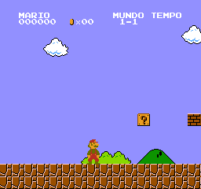

# S007 — host SDL2, 08/10/2026

Entrada: edfdc149bb6d3a47cceac03a82f5bd345a5d9177.
Reproduzir com tools/build_host.py e tests/test_host_frontend.py.
Ver ../../HOST_FRONTEND.md para dependências, mapeamento e limites.

- build.txt: hashes e build local.
- smoke.txt: 600 quadros, entrada SDL, render readback, execução sem ROM externa,
  confronto com hash independente e hits por opcode.
- sanitized-smoke.txt: mesmo smoke com ASan/UBSan, leak detection desabilitado.
- host-tests.txt: sete suítes canônicas passaram.
- host-frame.png: quadro 599, conversão da captura bruta (não screenshot desktop).
- host-linux-x86_64.tar.xz: executável Linux, header gerado e captura frame599.bin.
- hashes.json: SHA-256 do arquivo compactado e de seus membros.

Renderização SDL foi lida e conferida: amostra central de cada bloco 3x3,
61.440 pixels lógicos. O PNG usa o dump do core. Não confundir essa imagem
com uma foto do Xbox ou validação manual do desktop.

Binário exige SDL2 e bibliotecas de sistema. Não é executável Xbox/Android.
Nenhum áudio, controle físico ou teste humano validado. CI remoto não confirmado.
